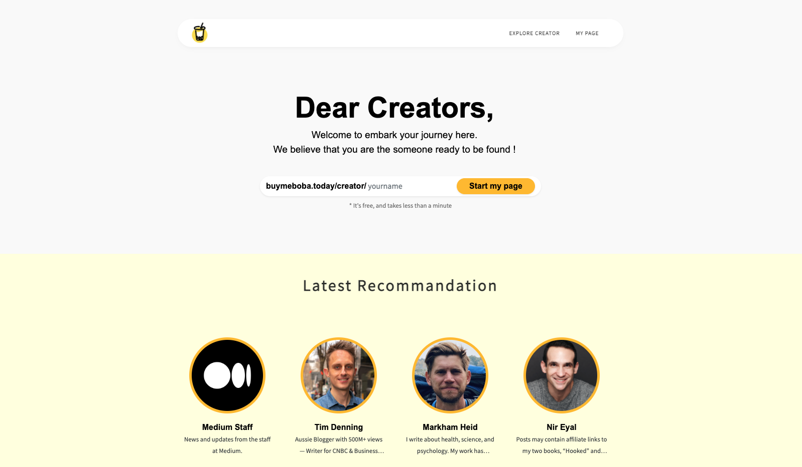
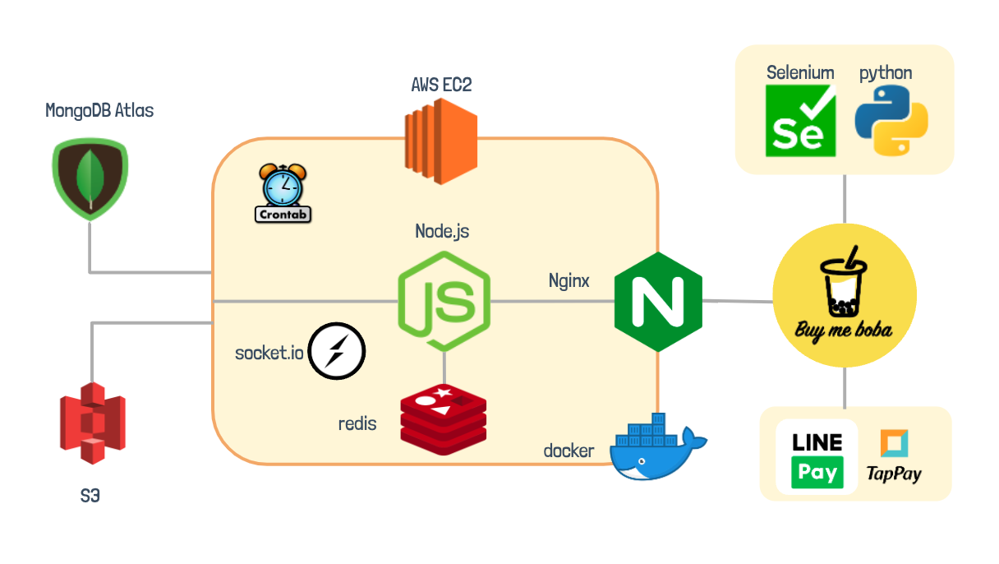
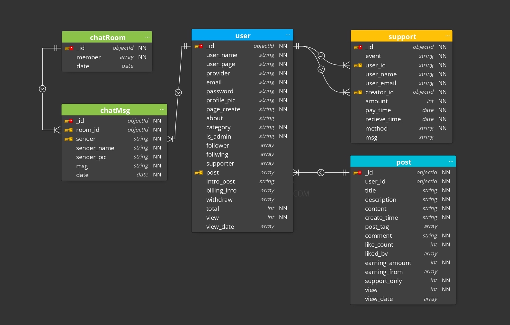
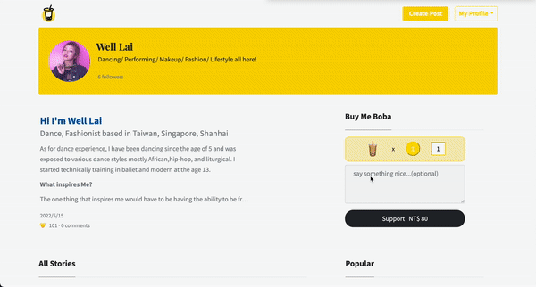
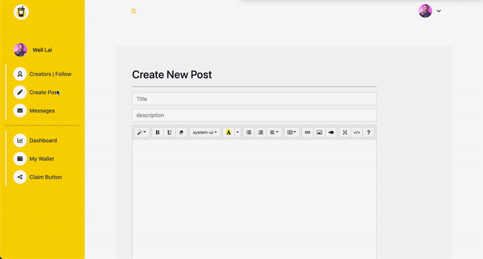
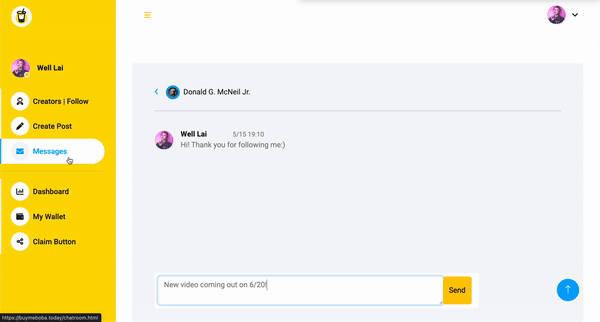
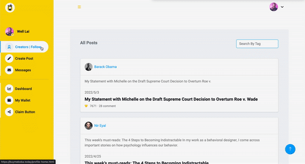
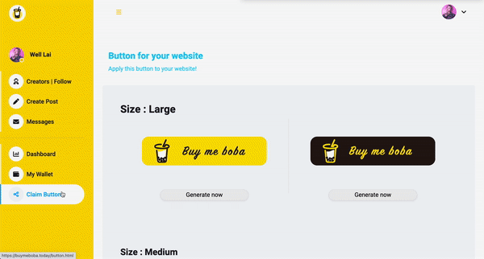

<!-- PROJECT LOGO -->
 

    <h1> buymeboba</h1>
    
  

    A meaningful platform built to help creators to be seen and be supported in a friendly way!
     
     
    Demo Account
     
     Login: test@test.com
     
     Password: test333
     
  

---
## About buymeboba
Start your page within less than a minute! buymeboba is a fully functioning monetization platform that helps you to share your thought and products. Interact with your supporters and get sponsors in a simple way.

Main featurs to expect from buymeboba:
- **Support:** Provides credit card and linepay payment methods to support creators in a simple way
- **Article posting:** Complete posting feature with post pinned and seen only by support functions
- **Messenger:** A real-time messenger with email sending faeutre that send to assigned membership
- **Dashboard:** Provides your page's hitoric performance data as well as reference data to help you improve your page performance
- **NewsFeed:** provides you the uptodate posts of your following creators with search function
---
## Technologies

- **Back-End:** Node.js, Express, NGINX, RESTful API

- **Front-End:** HTML, CSS, JavaScript, Bootstrap, Ajax

- **Database:** MongoDB, Redis

- **Cloud Service (AWS):** Elastic Compute Cloud (EC2), S3

- **3rd Party APIs and Open Source Tools:** Socket.IO, crontab, Selenium, BeautifulSoup, LINE Pay API, TapPay SDK

- **Environment:** Docker, Docker Compose

## Architecture

## Database Schema

## Main features

### Support 
* Support your admired creators with some heart-warming words and pay with credit card or LINE Pay

### Article post
* Post your new article with post tags and additional options: pinned post/ support only

### Messenger with email sending feature
* Chat with your members individually 
* Select certain type of membership(supporter/ followers) to send messages with an email sending option

### Dashboard
* Record your performance history data
* Analyze reader's interst and same category's best performing creators

### newsfeed
* Provide the latest creator posts you have followed and explore more interested posts by post tag seraching

### button gererate
* Provide you the button template that enable you to put it on your own website!

## Contact Me :)
* Email Address: rita.ningtang@gmail.com
